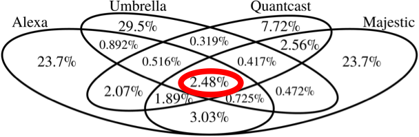

# ml-url-category

**This project is currently under construction.**

## How to Test with UI

AWS CLI
.env

open terminal and run

```
bash setup.sh --modes
```

then

```
docker-compose up
```

and then open http://localhost:8000/ with browser.

## DATA GATHERING

Here are some datasets I found. Currently using Tranco and DomCorp datasets.

## Alexa

alexa_top1m.zip

The Alexa Top 1 Million Websites project ranks websites based on popularity and traffic using data collected from users who have the Alexa Toolbar or Browser Extension installed. It's a widely used tool for web analysis, but it has limitations due to its data source. Users can access the rankings through a paid subscription service.

[Link to Kaggle](https://www.kaggle.com/datasets/cheedcheed/top1m)

## Cisco Umbrella

umbrella-top-1m.csv.zip

The Cisco Umbrella dataset is a collection of DNS (Domain Name System) activity and network traffic data gathered by Cisco's Umbrella security service. It includes information on domain requests, IP addresses, and web traffic patterns from a wide range of global sources. This dataset is used for cybersecurity purposes, such as identifying and blocking malicious websites and threats, as well as for improving network performance and security. It helps organizations protect their networks and devices from online threats by analyzing and categorizing internet traffic and domain information.

## Tranco

tranco_7PL5X.csv

ATranco-List.eu is a dataset that provides rankings of websites based on their popularity and traffic. It compiles this ranking by using multiple data sources, such as DNS data and web crawling. The list is updated frequently, often daily, and encourages community involvement for data contributions and refinement. Tranco-List.eu is openly accessible and serves as a valuable resource for understanding internet trends and website rankings. Created by the team over at ripe.net; they published an interesting article comparing Alexa, Cisco Umbrella, Majestic & Quantcast.



As shown clearly in this graphic there is very little similarity between the different lists.

## DomCorp

domcop_top10milliondomains.csv.zip

Using data from CommonCrawl and CommonSearch, the DomCop project has compiled a list of the top 10 million sites. Better yet, the full site list is available for Free Download.

## isniper

https://ipsniper.info/

General url list per domain, unranked.
