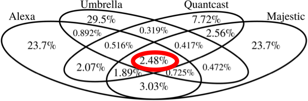

## Scraper

To run scraper you just do these steps:

```
conda create -n YOUR_ENV_NAME python==3.10

conda activate YOUR_ENV_NAME

pip install -r requirements.txt

python scrape.py --mode local
```

Check out config.py and set all your path/bucket variables there.
it supports 2 modes: local and s3.

I only used s3 mode, because I parsed more than 10m websites and they took terabytes.

## Overview of Parsed Datasets

### Alexa Top 1 Million Websites

- **Description**: Alexa ranks websites by popularity, utilizing data from its toolbar and browser extension users. It offers insights into web traffic and site ranking, albeit with data source limitations.
- **Link**: [Kaggle Dataset](https://www.kaggle.com/datasets/cheedcheed/top1m)

### Cisco Umbrella

- **Description**: This dataset encompasses DNS activity and network traffic, collected for cybersecurity analysis by Cisco's Umbrella service. It's instrumental in identifying threats, blocking malicious sites, and enhancing network security through traffic categorization.

### Tranco

- **Description**: Tranco combines multiple data sources to rank websites by popularity and traffic, updated daily. It encourages community contribution and is a free resource for tracking internet trends.
- **Noteworthy**: The creation team at ripe.net also discusses the comparative analysis of different ranking lists.
- **Visualization**: The graph below showcases the disparity among various ranking lists, highlighting the unique value Tranco offers.



### DomCorp

- **Description**: A compilation of the top 10 million websites using CommonCrawl and CommonSearch data. This dataset is freely available for download, offering a comprehensive list of sites.

### isniper

- **Description**: Provides an unranked, general list of URLs per domain.
- **Link**: [iSniper](https://ipsniper.info/)

This collection of datasets forms the backbone of our project, providing diverse insights into website rankings, traffic analysis, and cybersecurity considerations.
